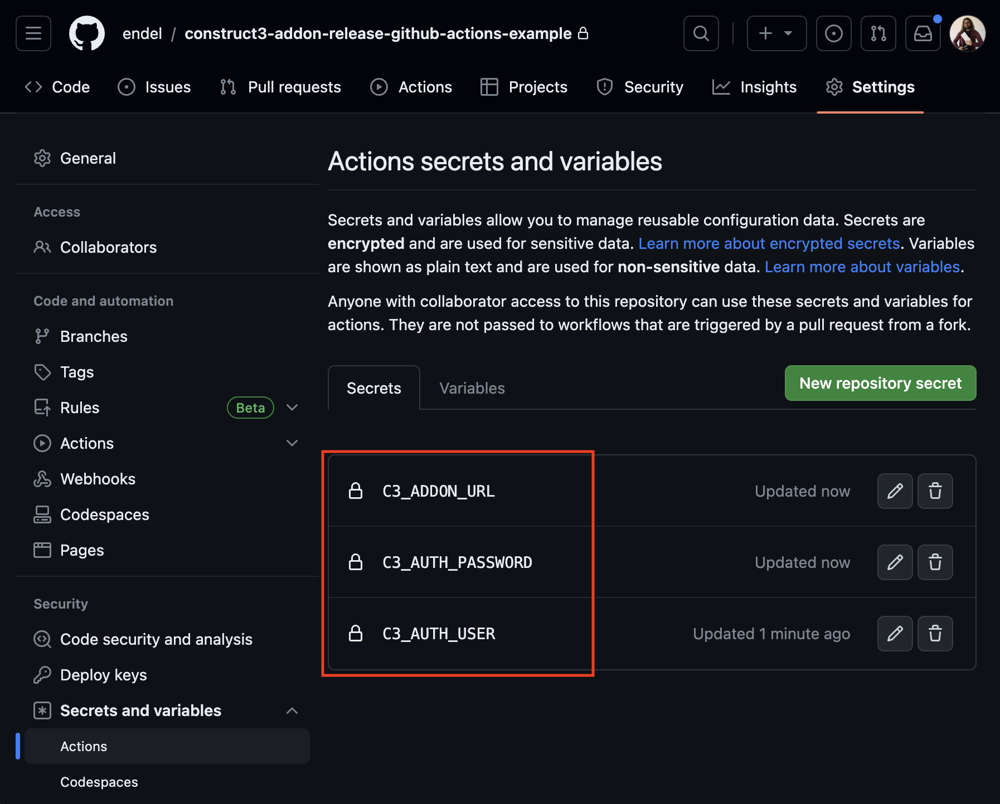

# Publishing a `.c3addon` to Construct3 Addons Page through GitHub Actions

Uses a headless puppetter to log-in into the construct.net website, create a
release based on the version change of specified `addon.json` file, and upload
the `.c3addon` file.

See [`.github/workflows/release.yml`](.github/workflows/release.yml) config.

Store your secrets via your repo settings: (not recommended to place it directly
in the `.yml` file.)

